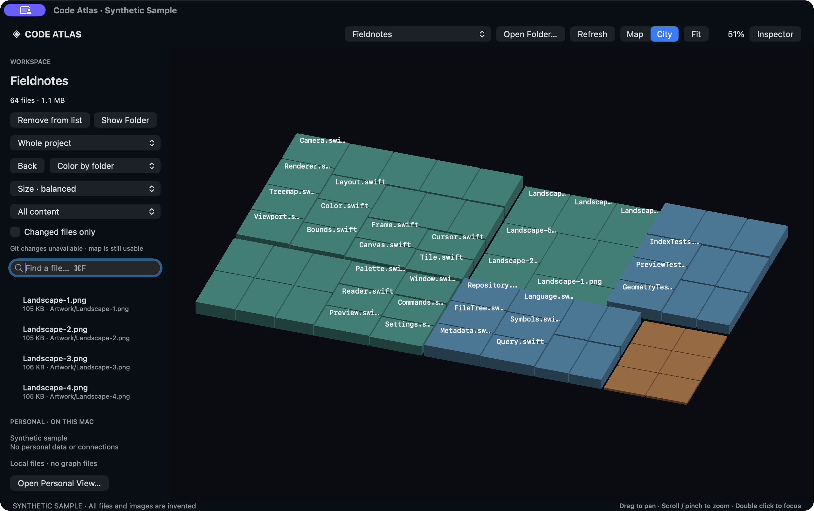

# Code Atlas 0.5.0

[**App page, screenshots & demo video →**](https://fibonacciai.github.io/code-atlas/)

[](https://fibonacciai.github.io/code-atlas/)

The gallery and silent video show the actual app using only invented code, documents, and artwork. No personal files, desktop content, or microphone audio are included. [Media provenance](docs/public-media.md).

Native macOS file explorer built with Swift, AppKit, and Metal. Zoom from a folder map into readable code, documents, pictures, and playable media. Requires macOS 14 or later and Swift 5.10+. Run `./script/build_and_run.sh` to build and open the app. Normal startup restores your last real folder. Sample mode is available only through the explicit `--demo` developer launch.

## Explore

- Open Folder accepts supported code, images, media, and documents. Compiled application bundles get an explanation instead of a misleading empty project.
- Remove from list forgets a workspace without deleting its files. Show Folder reveals it in Finder.
- Drag to pan. Scroll down into a file, then continue down through its content. Scroll up through the document and keep scrolling at the top to return to the map. Images and media return with upward scrolling. Pinch out, Escape, and Map also exit. Momentum alone cannot open or close a file.
- Map and City share an animated transition into source, Markdown/text, HTML, images, PDF, audio, and video. Previews lay out at reading size once and animate their composited surface. Text is bounded to 4 MiB, with syntax styling limited to the first 128,000 characters.
- Map and City share the same footprint. Balanced sizing is the default; choose lines, bytes, or equal sizes. City height is logarithmic line count.
- Search highlights matching files. Color by folder, language, or Git status; optionally filter changed files.
- Selecting a file opens the inspector: styled source, lexical outline, local import candidates, and bounded textual occurrence search. These are not semantic definitions or references.
- Nearby visible tiles request bounded source previews automatically. Text is drawn through AppKit over instanced Metal geometry. Image, video, and PDF thumbnails are instanced in the same Metal render pass as their tiles, with pinned visible slots to prevent reload flashing.

## One workspace, three views

Map, City, and Graph are top-level views of the same workspace. File selection and the inspector stay shared. Returning from Graph preserves the spatial camera. Command–Option–M/C/G switches views; Command–F searches files in every view.

Graph uses bundled Mermaid 11.12.2, entirely offline. It draws bounded local import candidates, Markdown links, and any supplied context relationships. The footer states coverage: a maximum of 100 displayed nodes and edges, with source text read from at most 80 files in 24 KiB slices. Search or select a file to narrow the view. Import candidates are lexical matches, not semantic compiler analysis. Isolated files are shown without invented relationships.

Connections opens the shared inspector, not another workspace or window. An explicit question requests a bounded projection from an optional local service. Selecting a graph entity shows its supplied claims, source references, and relationships in that inspector. Evidence is associated with files only when a supplied reference exactly matches an allowed indexed file; those source tiles highlight in Map and City. A file remains usable without any connected service.

The client discovers its read contract first and uses only issued scopes. No raw graph files, graph writes, or remote embeddings are involved. The graph renderer receives bounded display labels and generated aliases, never credentials, evidence payloads, or filesystem access outside its bundled assets. Loaded context remains in memory. Clear, changing folders, and closing the window cancel outstanding reads and remove results. A window that has requested connected context stays protected from capture for its lifetime. Connection options holds an optional memory-only scoped read token.

Developer verification uses explicitly generated fixtures. Normal launches restore only folders the user has opened.

## Save and navigate

Use File → Save View (Command-S) to keep the folder, file filters, selection, and view mode locally. File → Restore Saved View (Command-Option-S) restores those settings; camera positions are not saved. File → Export Graph saves a `.md` document containing the file relationship diagram in a fenced Mermaid block. Export is unavailable while connected context is loaded.

In Graph, use Selection + neighbors for a focused relationship view. Zooming into a file node opens the native reader; scrolling up beyond the top, pinching out, or pressing Escape closes it back to the same graph camera. Dashed edges denote lexical import candidates, not resolved compiler dependencies.

## Performance and limits

The packaged app uses an optimized release build. Camera transitions use monotonic timing and common run-loop modes, with reduced-motion support. Unchanged filter and selection assignments avoid unnecessary instance uploads. Labels and preview reads are bounded; rendering is demand-driven. These changes are not a measured frame-rate guarantee.

The source index is memory-only and never writes to selected repositories. Git listing honors ignore rules with timeout/cancellation and a 32 MiB output bound. Non-Git roots use a filtered walk. Source extensions are allowlisted; hidden entries, private graph/state, secrets/credential filenames, excluded project folders, symlinks, binary files, dependencies, and generated output are excluded. File size limit: 4 MiB; count limit: 50,000. Filtering is not a general secret detector for arbitrary source contents.

Source preview cache holds up to 32 bounded snippets, with four requests in flight. Inspector source is capped at 128 KiB. Textual occurrence search is capped at 5,000 indexed files. Semantic analysis, incremental watching, and a GPU glyph atlas remain future work. Sustained 120 Hz and 2.5-million-line performance have not been measured.

## Build and checks

```sh
swift test
./script/build_and_run.sh --build-only
.build/release/CodeAtlas --audit /path/to/source
.build/release/CodeAtlas --verify-workspace-ui
```

The test suite covers indexing, layout, graph escaping and limits, source matching, cancellation, syntax, outlines, Git state, private-path exclusions, and navigation boundaries. `--verify-workspace-ui` uses generated files and an injected service to exercise actual Mermaid rendering, shared selection, context inspection, cancellation, and folder switching. It writes aggregate verification results and test-window captures into the temporary directory, then exits. It never loads saved workspaces or live connected context.

Three recently scanned folders keep metadata/layout snapshots in memory. Switching back displays the cached map immediately while a fresh scan runs. Background results never reset the camera or open file; changed results are applied by Refresh. The first scan of a large folder still takes time and shows loading/cancel controls immediately.

This is a local development build, not a notarized release.

## Mixed-content atlas

Open Folder indexes supported photos, video, audio, PDF, and document files alongside code. Binary media is indexed from metadata, without reading whole files. Balanced layout is the default; choose lines, bytes, or equal tile sizes. Type filters dim unrelated files. Nearby image/video/PDF tiles request bounded thumbnails: four requests in flight, 128 GPU slots in a 24 MiB texture array, and at most 70 visible detail tiles. Visible images remain pinned while offscreen slots are reused in least-recently-used order.

Double click or choose Preview to open a file in the map viewport. Native image, PDF and media previews are available. Markdown/plain text is readable inside Atlas. HTML uses a static local renderer, with scripts and external assets disabled; Source remains available. Empty application shells show a native explanation. Other document layouts open in their associated app. React apps still require their project runtime for interactive preview.

The small-tile zoom dead end is fixed: a visible tile opens at the zoom limit even when it cannot fill the viewport. Direct Preview and double click always provide an entry route. Escape and scroll navigation are handled around the native preview so focused webpage/player controls cannot trap the user.

Audio has native Play/Pause/Replay, seek, skip, player volume, and mute controls. A separate Mac output indicator reports system mute/volume when supported. Only the explicit Unmute Mac button changes system output mute; opening a file never starts playback or changes system sound settings.

## Local connections

Atlas has no configured cloud backend, telemetry, upload service, or direct external AI calls. Its optional context connection is loopback-only. The file explorer works without that service. HTML previews block scripts and remote assets. Mermaid executes only its bundled renderer; network requests and external navigation are blocked. Opening a file in its default app hands it to that application's own behavior and permissions.
